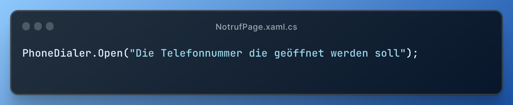

<h1 align=center>Erste Hilfe App - Projektseite</h1>

<div align=center>
    </img>
</div>

<h3 align=center>von Jan Drewes (@LandingTheMoon) & 
Louis Lemberg (@MindOfUs)</h3>

## Übersicht

<ol>
    <li>
        <a href="#einfuehrung">Einführung</a>
        <ol>
            <li>
                <a href="#gruppe">Die Gruppe</a>
            </li>
            <li>
                <a href="#idee">Die Idee</a>
            </li>
        </ol>
    </li>
    <li>
        <a href="#programme">Die verwendeten Programme</a>
        <ol>
            <li>
                <a href="#xamarin">Xamarin Forms (Framework)</a>
            </li>
            <li>
                <a href="#c#">C# (Programmiersprache)</a>
            </li>
            <li>
                <a href="#visualstudio">VisualStudio 2022 (Programmierumgebung)</a>
            </li>
        </ol>
    </li>
    <li>
        <a href="#firstaid">Erste Hilfe App - Coderklärung</a>
        <ol>
            <li>
                <a href="#mainpage">Startseite</a>
            </li>
            <li>
                <a href="#notruf">Notrufseite</a>
            </li>
            <li>
                <a href="#reanimation">Reanimationsseite</a>
            </li>
            <li>
                <a href="#puls">Pulsseite</a>
            </li>
        </ol>
    </li>
    <li>
        <a href="Design von der App.md">Design von der App und vom Code</a>
    </li>
    <li>
        <a href="Stundenprotokoll.md">Stundenprotokoll</a>
    </li>
    <li>
        <a href="#sources">Quellen</a>
    </li>
    <li>
        <a href="#eigen">Eigenständigkeitserklärung</a>
    </li>
</ol>

## Einführung <a name="einfuehrung"></a>

Im ersten Abschnitt unserer Projektseite werden wir zuerst einmal unsere Gruppe, sowie unsere Projektidee erklären.

### 1. Die Gruppe <a name="gruppe"></a>

Unsere Gruppe besteht aus Jan Drewes und Louis Lemberg, wir gehen beide in das Physikprofil der 11. Klasse. Für uns war von Anfang an klar, dass wir wieder zusammenarbeiten wollen, da die Zusammenarbeit im ersten Halbjahr während des ersten Informatik.-Projekts schon sehr gut funktioniert hat. Dadurch dass wir letztes Halbjahr schon zusammengearbeitet, sind wir vom Kenntnisstand auch ungefähr auf einem Level.

### 2. Die Idee <a name="idee"></a>

Für uns beide war von Anfang an klar, dass wir nicht wie im letzten Jahr mit Python programmieren wollen, sondern uns eine neue Herausforderung suchen wollen. Dabei sind wir relativ schnell auf die Idee gestoßen, eine eigene App zu programmieren. Auch das Thema der App war uns durch Jans Leidenschaft durch die Arbeit bei der DLRG und beim Schulsanitätsdienst für das Rettungswesen klar, somit entschieden wir uns dazu eine Erste-Hilfe-App zu programmieren. Die nur die wichtigsten Funktionen, wie eine Notrufseite mit den Nummern für den Rettungsdienst aus fast allen erupäischen Ländern, ein Metronom, dass bei der Herz-Lungen-Wiederbelebung unterstützt und eine Seite, die dir hilft den Puls zu berechnen, umfasst.

## Die verwendeten Programme <a name="programme"></a>

In diesem Abschnitt erklären wir die verwendeten Programme, sowie die verwendten Programmiersprachen und warum wir diese verwendet haben.

### 1. Xamarin Forms (Framework) <a name="xamarin"></a>

Als Framwork für unsere App haben wir uns für Xamarin Forms entschieden, das uns dies die Möglichkeit bot eine Cross-Plattform App zu programmieren. Xamarin Forms hat seine eigene Programmiersprache zum Designen der Bestandteile der App.

### 2. C# (Programmiersprache) <a name="c#"></a>

Für den Code der Funktionen in der App verwendet Xamarin Forms die Programmiersprache C#. Dies ist eine objektorientierte plattformunabhängige Programmiersprache, die universiell einsetzbar ist. Wir beide mussten uns diese Programmiersprache erstmal aneignen aber nach anfänglichen kleineren Schwierigkeiten beherrschten wir auch sicher die Grundlagen von C#.

### 3. Visual Studio 2022 (Programmierumgebung) <a name="visualstudio"></a>

Als Programmierumgebung haben wir uns mehr oder weniger freiwillig für Visual Studio 2022 entschieden. Wir waren an Visual Studio gebunden, da diese Programmierumgebung für Xamarin Forms empfohlen wird und auch sehr einfach zu bedienen ist. Aber auch ansonsten ist Visual Studio 2022 eine sehr übersichtliche IDE, die sich abseits von Visual Studio für zahlreiche umfangreiche und plattformübergreifende Anwendungen empfiehlt.

## Erste Hilfe App - Coderklärung <a name="firstaid"></a>

### Startseite <a name="mainpage"></a>

### Notrufseite <a name="notruf"></a>

Drückt man nun den Notruf-Knopf auf der Startseite der App landet man auf der Notrufseite. Hier sind mehrere Knöpfe zusehen die jewals den Notruf führ das auf den knopf stehende Land auslösen. Man muss hierzu erwähnen das der anruf nicht dirket gestartet wird sondern sich nur Wählapp vom Gerät öffnet. Dies haben wir so implementiert damit ein nicht gewohlter Anruf vermieden wird. Um die Telefonnummer nun mit der Wählerapp zu öffnen wird die "PhoneDialer" Class von Xamarin Essentials benutzt. Mit hilfe von einer zwei zusatz Zeilen Code in der AndroidManifest.xml, damit "PhoneDialer" auch mit neueren Versionen von Android funktioniert, reicht es letzendlich bei einem Knopf druck in der C# Datei die Zeile einzufügen:

<div align=center>
    </img>
</div>

```
PhoneDialer.Open("Die Telefonnummer die geöffnet werden soll");
```

### Reanimationseite <a name="reanimation"></a>

### Pulsseite <a name="puls"></a>

## Quellen <a name="sources"></a>

<ol>
    <li>
        <a href="https://www.python-engineer.com/posts/chatbot-pytorch/">https://www.python-engineer.com/posts/chatbot-pytorch/</a>
    </li>
</ol>

Alle Links wurden zuletzt erfolgreich am II.06.2023 um II.II Uhr geöffnet.

## Eigenständigkeitserklärung <a name="eigen"></a>

Wir bestätigen hiermit, dass unser Ergebnis, ein von uns eigens erschaffenes Produkt ist, und wir uns bei der Umsetzung einzig durch die angegebenen Quellen geholfen haben.