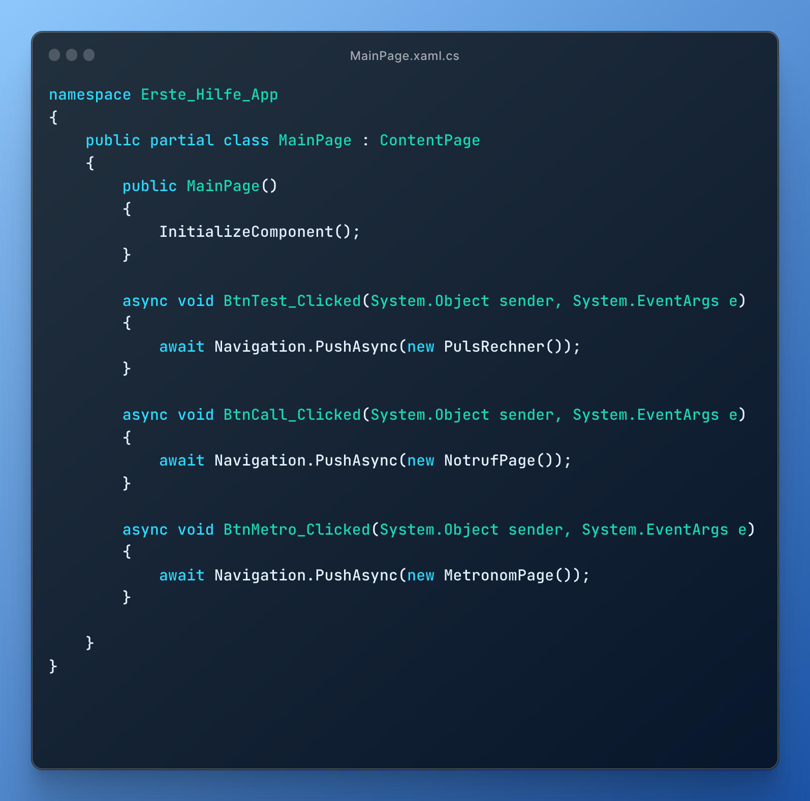
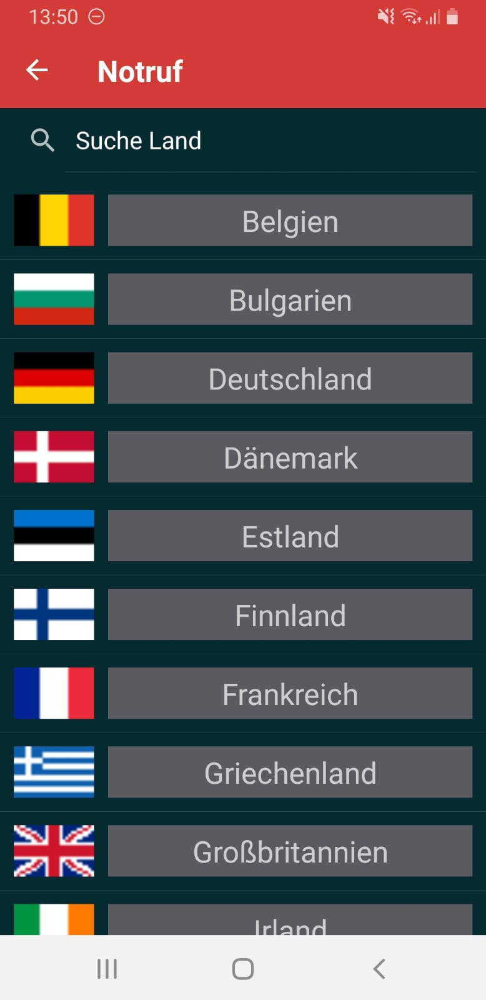
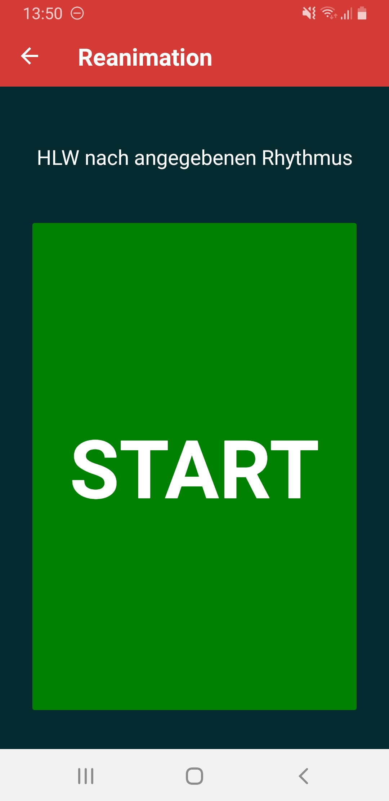
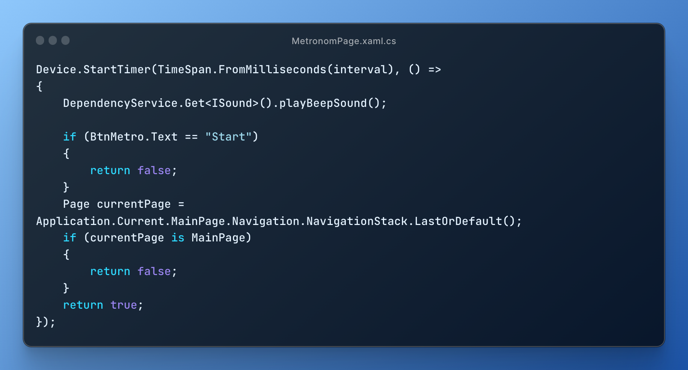

<h1 align=center>Erste Hilfe App - Projektseite</h1>

<div align=center>
    </img>
</div>

<h3 align=center>von Jan Drewes (@LandingTheMoon) & 
Louis Lemberg (@MindOfUs)</h3>

## Übersicht

<ol>
    <li>
        <a href="#einfuehrung">Einführung</a>
        <ol>
            <li>
                <a href="#gruppe">Die Gruppe</a>
            </li>
            <li>
                <a href="#idee">Die Idee</a>
            </li>
        </ol>
    </li>
    <li>
        <a href="#programme">Die verwendeten Programme</a>
        <ol>
            <li>
                <a href="#xamarin">Xamarin Forms (Framework)</a>
            </li>
            <li>
                <a href="#c#">C# (Programmiersprache)</a>
            </li>
            <li>
                <a href="#visualstudio">VisualStudio 2022 (Programmierumgebung)</a>
            </li>
        </ol>
    </li>
    <li>
        <a href="#firstaid">Erste Hilfe App - Coderklärung</a>
        <ol>
            <li>
                <a href="#mainpage">Startseite</a>
            </li>
            <li>
                <a href="#notruf">Notrufseite</a>
            </li>
            <li>
                <a href="#reanimation">Reanimationsseite</a>
            </li>
            <li>
                <a href="#puls">Pulsseite</a>
            </li>
        </ol>
    </li>
    <li>
        <a href="#video">Video von der App</a>
    </li>
    <li>
        <a href="Stundenprotokoll.md">Stundenprotokoll</a>
    </li>
    <li>
        <a href="#reflex">Reflexion</a>
    </li>
    <li>
        <a href="#sources">Quellen</a>
    </li>
    <li>
        <a href="#eigen">Eigenständigkeitserklärung</a>
    </li>
</ol>

## Einführung <a name="einfuehrung"></a>

Im ersten Abschnitt unserer Projektseite stellen wir unsere Gruppe vor und erklären unsere Projektidee.

### 1. Die Gruppe <a name="gruppe"></a>

Unsere Gruppe besteht aus Jan Drewes und Louis Lemberg, wir gehen beide in das Physikprofil der 11. Klasse. Für uns war von Anfang an klar, dass wir wieder zusammenarbeiten wollen, da die Zusammenarbeit während des ersten Informatik-Projektes schon sehr gut funktioniert hat. Aufgrund der Zusammenarbeit im letzten Halbjahr, sind wir vom Kenntnisstand ungefähr auf einem Level.

### 2. Die Idee <a name="idee"></a>

Wir wussten von Beginn, dass wir nicht wieder mit Python programmieren, sondern uns eine neue Herausforderung suchen wollen. Dabei sind wir relativ schnell auf die Idee gestoßen, eine eigene App zu programmieren. Aufgrund von Jans Leidenschaft und seiner Tätigkit beim DLRG und den Schulsanitätsdienst, war schnell klar, dass das Thema der App etwas mit Rettungswesen zu tun haben soll. Somit entschieden wir uns dazu eine Erste-Hilfe-App zu programmieren, die drei wichtige rettungsrelevante Funktionen enthält. Sie hat eine Notrufseite mit den Nummern für den Rettungsdienst aus fast allen erupäischen Ländern, ein Metronom, das bei der Herz-Lungen-Wiederbelebung unterstützt und eine Seite, die hilft den Puls zu berechnen.

## Die verwendeten Programme <a name="programme"></a>

In diesem Abschnitt erklären wir die verwendeten Programme und Programmiersprachen, sowie warum wir diese verwendet haben.

### 1. Xamarin Forms (Framework) <a name="xamarin"></a>

Als Framwork für unsere App haben wir uns für Xamarin Forms entschieden, da es uns die Möglichkeit bot eine Cross-Plattform App zu programmieren. Xamarin Forms hat seine eigene Programmiersprache zum Designen der Bestandteile der App.

### 2. C# (Programmiersprache) <a name="c#"></a>

Für den Code der Funktionen in der App verwendet Xamarin Forms die Programmiersprache C#. Dies ist eine objektorientierte plattformunabhängige Programmiersprache, die universiell einsetzbar ist. Wir beide mussten uns diese Programmiersprache ersteinmal aneignen, aber nach anfänglichen kleineren Schwierigkeiten haben wir schnell und sicher die Grundlagen von C# beherrscht.

### 3. Visual Studio 2022 (Programmierumgebung) <a name="visualstudio"></a>

Als Programmierumgebung haben wir uns für Visual Studio 2022 entschieden. Wir waren an Visual Studio gebunden, da diese Programmierumgebung für Xamarin Forms empfohlen wird und auch sehr einfach zu bedienen ist. Aber auch ansonsten ist Visual Studio 2022 eine sehr übersichtliche IDE, die sich abseits von Visual Studio für zahlreiche umfangreiche und plattformübergreifende Anwendungen empfiehlt.

## Erste Hilfe App - Coderklärung <a name="firstaid"></a>

Im folgenden Abschnitt erklären wir den Code unserer App. Die App gliedert sich in vier Seiten, Startseite,Notrufseite, Reanimationsseite und Pulsseite. Für jede Seite gibt es eine '.xaml'-Datei für das Design und Layout, sowe eine '.xaml.cs'-Datei, welche den Code für die Funktionalität enthält.

### Startseite <a name="mainpage"></a>

Von der Startseite können alle Funktionsseiten aufgerufen werden, die Reihenfolge ist beliebig. Um zwischen den Funktionsseiten zu wechseln muss man immer zuvor wieder auf die Startseite zurückkehren.

<div align=center>
    </img>
</div>

<details>
<summary>Design ('.xaml'-Datei)</summary>

Die Seite ist einfach und übersichtlich aufgebaut, da im Notfall so schnell wie möglich zu der Funktion gelangen soll, die man gerade benötigt. Daher besteht sie auch nur aus 3 Buttons.

Zu Beginn haben wir die Leiste am oberen Bildschirmrand designt. Diese ist bereits standardmäßig vorhanden, da wir die Seite als 'NavigationPage' festgelegt haben. 

<div align=center>
    </img>
</div>

Wir erzeugen ein Label innerhalb dieser Leiste. Dem Label wird ein Inhalt, hier ein Text, zugeordnet und anschließend die Größe, die Eigenschaft (hier, dass die Schrift "fett" sein soll) und die Farbe festgelegt. Danach bestimmen wir wo dieser Text stehen soll, also horizontal am Start (ganz links) des Labels und vertikal in der Mitte vom Label.

Für die 3 Buttons erzeugen wir eine Tabelle, in welcher die Buttons angeordnet werden.

<div align=center>
    </img>
</div>

Zuerst legen wir die Hintergrundfarbe der Tabelle und die Größe der Reihen fest. Dann bestimmen wir viele Reihen und Spalten unsere Tabelle haben soll. In unserem Fall sind es 3 Reihen und 1 Spalte.

<div align=center>
    </img>
</div>

Der Code für die 3 Buttons sieht jeweils so aus (beispielhaft am Code für den ersten Button). Als erstes sagen wir jeweils, wo in der Tabelle der Button platziert werden soll, d.h. in der wie vielten Reihe bzw. Spalte, wobei die Zählung immer bei "0" beginnt. Dann wird auch diesem Button ein Text und eine dazugehörige Größe zugeordnet. Zusätzlich bekommen die Button noch ein Padding von 50px. Am Ende geben wir dem Button noch einen Namen, mit welchem wir dann in anderen Dateien wieder auf diesen Button zugreifen können. Die darauf folgende Zeile erzeugt eine Funktion in der '.xaml.cs'-Datei, welche beim Klicken des Buttons aufgerufen wird. Zu guter Letzt geben wir dem Button noch eine Höhe.
</details>

<details>
<summary>Funktion ('.xaml.cs'-Datei)</summary>
Zuerst werden, wie bei allen Dateien, auch hier alle Librarys importiert, welche wir für die jeweilige Datei benötigen. In diesem Fall sind das:

<div align=center>
    </img>
</div>

Darauf folgt der eigentliche Code:

<div align=center>
    </img>
</div>

Die Zeile 'InitializeComponent();' sorgt dafür, dass alles was wir vorher in der '.xaml'-Datei geschrieben haben, nun auch erzeugt wird. 

Die drei Funktionen danach sind die bereits schon angesprochenen, welche nach dem Klicken des jeweiligen Buttons ausgeführt werden. In diesem Fall sorgt der Code innerhalb dieser Funktion einfach nur für das Weiterleiten zur nächsten Seite.

<details>
<summary>Exkurs 'NavigationPage'</summary>
Um dieses Weiterleiten überhaupt möglich zu machen, muss die Startseite als 'NavigationPage' festgelegt werden. Dafür muss in die 'App.xaml.cs'-Datei gehen, die dafür sorgt, dass die App gestartet wird, folgende Zeilen Code einfügt werden:

<div align=center>
    </img>
</div>

Zusätzlich haben wir dann noch die Farbe und den Text von der oben ansässigen Leiste festgelegt, die oben bereits erwähnte.
</details>
</details>


### Notrufseite <a name="notruf"></a>

Drückt man nun den Notruf-Button auf der Startseite der App landet man auf der Notrufseite. Hier sind mehrere Knöpfe innerhalb einer Liste zu sehen, die jeweils den Notruf für das aufgelistete Land auslösen. Bei den Ländern haben wir uns zunächst auf alle europäischen Länder beschränkt.

<div align=center>
    </img>
    </img>
</div>

<details>
<summary>Design ('.xaml'-Datei)</summary>
Auch auf dieser Seite designen wir zuerst die Leiste am oberen Bildschirmrand. Dabei gehen wir genauso vor wie bei der Startseite, außer dass wir den Text natürlich geändert haben.

Danach fügen wir auf der Seite direkt unter der Leiste eine Searchbar ein, mit welcher man dann auf alle Elemente innerhalb der Liste zugreifen kann.

<div align=center>
    </img>
</div>

Zunächst geben wir der Searchbar einen Placeholder-Text, welcher angezeigt wird, wenn sich kein Text im Textfeld befindet. Dann legen wir, wie bei den Buttons einen Namen fest, um später wieder auf die Liste zugreifen zu können. Um die Suchfunktion zu ermöglichen, legen wir den 'TextChanged'Parameter fest, um spätr auf die Eingabe des Users zuzugreifen. Dann geben wir den Texten sowie dem Cancel-Button, welcher automatisch bei einer Searchbar vorhanden ist, die Farbe weiß.

Im nächsten Schritt erzeugen wir die Liste, welche die Länder und ihre zugehörigen Flaggen enthält.

<details>
<summary>Kompletter Code für die Liste</summary>
<div align=center>
    </img>
</div>
</details>

Wichtig bei dem Code ist, dass wenn ein Item berührt worden ist (Funktionalität entspricht der eines Buttons), wieder eine Funktion erzeugt und aufgerufen wird. Die beiden Elemente (Image und Label bzw. hier Flagge und Land), die in der Liste aufgeführt sind, bekomme erst in der '.xaml.cs'-Datei ihre Werte.

</details>

<details>
<summary>Funktion ('.xaml.cs'-Datei)</summary>
Auf dieser Seite werden zuerst die ganzen Librarys importiert und das Grundgerüst für den Code geschaffen.

<div align=center>
    </img>
</div>

Dies ist der erste Teile vom Code, welcher automatisch beim Öffnen der Seite ausgeführt wird. Für das bessere Verständnis erklären wir zunächst folgendes:

<details>
<summary>Exkurs 'Class_Template'</summary>

Für das Erzeugen der Liste haben wir auf Grund der hohen Anzahl an Items eine Class erstellt, die das Einfügen erleichter. Die Class sieht wie folgt aus:

<div align=center>
    </img>
</div>

Sie sorgt dafür, dass nur zwei Dinge angeben werden müssen, zum einen wie das Land heißt und zum anderen wo das Programm die Flagge des Landes findet. Mit diesen Informationen wird dann das Item innerhalb der Liste erstellt.

</details>

Zunächst erstellen wir eine 'public'-Variable tempdata, die dieListe, welche mit Hilfe der Class erzeugt wird. Dann werden alle Elemente erstellt, welche in der '.xaml'-Datei definiert wurden. Daraufhin erzeugen wir alle Items für die Liste,  mit Hilfe von Class_Template. Die Codezeilen für Belgien, stehen beispielhaft für alle Items. Die letzte Zeile des Codes sorgt dafür, dass alle Items angezeigt werden.

Nun folgt die Funktion, welche aufgerufen wird, wenn ein Item ausgewählt worden ist.

<div align=center>
    </img>
</div>

Zunächst wird das aufgerufene Item als Class_Template innerhalb einer Variablen gespeichert. Dies wird gemacht, damit das Label und das Image getrennt voneinander ausgelesen werden können. Dann folgt der eigentliche Code. Es wird anhand des Labels mit dem Ländernamen geguckt, welches Land ausgewählt wurde und mit Hilfe der internen Funktion von Xamarin Essentials 'PhoneDialer.Open("112");' wird Notrufnummer in Wähltastur angezeigt und sodass der Benutzer den Anruf nur noch absetzen muss. Dies haben wir so implementiert damit nicht aus versehen Notrufnummern gewählt werden können.

Zu guter letzt folgt nun noch die Funktion der Searchbar, um die Suchfunktion zu ermöglichen.

<div align=center>
    </img>
</div>

Der Userinput zu einem String konvertiert, der nur aus Kleinbuchstaben besteht. Dies wird gemacht, damit später eine einfach und einheitlich Suche gewährleistet werden kann. Wenn der Input leer ist, dann sollen weiterhin alle Items der Liste angezeigt werden. Falls der Input nicht leer ist, sollen nur die Items bzw. auch nur das einzige Item angezeigt werden, die zu dem Input passen. Die letzte Zeile Code sorgt dafür, dass jeweils der erste Buchstabe aus dem Input groß geschrieben wird, damit wir den Input mit unseren Items abgleichen können.

</details>

### Reanimationseite <a name="reanimation"></a>

Wählt man auf der Startseite den Reanimationsbutton landet man auf der entsprechenden Seite. Diese ist ein Metronom, das bei der Reanimation bzw. der Herz-Lungen-Wiederbelebung unterstützen soll, indem es den Takt vorgibt.

<div align=center>
    </img>
    </img>
    </img>
</div>

<details>
<summary>Design ('.xaml'-Datei)</summary>

Auf dieser Seite designen wir zunächst die Leiste am oberen Bildschirmrand. Die Seite enthält zwei Elemente, zum einen einen Info-Text, in Form eines Buttons, der beim Klicken eine Erklärung gibt, und zum anderen einen großen Button, welcher nach dem Klicken eine Funktion erzeugt.

<div align=center>
    </img>
</div>

</details>

<details>
<summary>Funktion ('.xaml.cs'-Datei)</summary>
Zunächst werden die nötigen Librarys importiert und die Elemente aus der Designdatei erzeugt, darüber hinaus definieren wir einige Variablen, welche im weiteren Verlauf gebraucht werden:

```
private int tempo_bpm = 110;
private double interval;
private int i = 0;
```

Beim Klicken das Buttons mit dem Info-Text wird ein PopUp-Fenster erzeugt, welches die Abkürzung HLW erklärt.

<div align=center>
    </img>
</div>

Es folgt nun die Erklärung für den Code, wenn der große Button auf dieser Seite geklickt wird.

<details>
<summary>Kompletter Code für die Funktion beim Klicken</summary>

<div align=center>
    </img>
</div>

</details>

Zunächst wird das Intervall festgelegt in welchem Abstand das Metronom später den Ton abspielen soll. Dafür wird ein Wert in Millisekunden benötigt. Der Variablenwert wird durch 2 geteilt. Ist der Rest gleich 0 und somit der Wert gerade, bleibt der Button grün und zeigt weiterhin 'Start'. Ist der Rest ungleich 0 un der somit der Wert ungerade, wird Button rot und der Text ändert sich zu "Stop" und das Metronom startet.

<div align=center>
    </img>
</div>

Dafür starten wir einen Timer mit Intervall in Millisekunden, das wir bereits festgelegt haben und der BeepSound wird abgespielt. Für diese 'playBeepSound'-Funktion verwenden wir den MediaPlayer von Android. Der Timer würde theoretisch endlos weiter laufen, deshalb gucken wir zum einen, ob der Text des Buttons "Start" ist, und zum anderen, ob die aktuelle Seite die Startseite ist. In diesen Fällen stoppt der Timer.

</details>

### Pulsseite <a name="puls"></a>

Druch Klicken des Puls-Buttons auf der Startseite gelangt man zur 'Pulsseite', mit welcher man den ungefähren Puls ermittlen kann. Dafür muss der Erst-Helfende den Puls für 15 Sekunden messen, den Wert auf der Seite eintragen und das Programm rechnet dann die Anzahl der Schläge auf eine Minute hoch.

<div align=center>
    </img>
    </img>
    </img>
</div>


<details>
<summary>Design ('.xaml'-Datei)</summary>
Zunächst wird die Leiste angepasst und eine Tabelle erstellt, in welcher wir all unsere Elemente angeordnet haben.

Zum einen haben wir ein Label mit einem kleinen Info-Text. Dann folgt ein selbst erstellter Timer aus einer Anzeige und zwei Buttons für Start und Stop. Dann kommt noch ein Eingabefeld, bei welchem der User nur Zahlen eingeben kann, dafür sorgt das Öffnen des 'Numeric'-Keyboard. Darunter liegt das Label, in welchem später das Ergebnis der Berechnung erscheint. Ganz unten auf der Seite folgt noch ein Button der alles zurücksetzt.

<details>
<summary>Kompletter Code des Designs</summary>

<div align=center>
    </img>
</div>

</details>
</details>

<details>
<summary>Funktion ('.xaml.cs'-Datei)</summary>
Zunächst werden die benötigten Librarys importiert und erzeugen die Seite mit allen Elementen aus der '.xaml'-Datei. Weiterführend definieren wir wieder zwei Variablen:

```
private bool TimerRunning = false;
private int seconds = 15;
```

Für den Timer erstellen wir noch eine Funktion, die falls der Timer nicht läuft oder die Anzeige gleich 00:00:00 anzeigt den Wert 'false' liefert. Ist der Funktionswert 'true, wird von der Sekunden-Variable immer der Wert 1 subtrahiert, und der Anzahl der übriggebliebenen Sekunden wird immer entsprechend angepasst angezeigt. 

<div align=center>
    </img>
</div>

Wenn der "Start"-Button geklickt wird, wird der Timer gestartet, sofern er noch nicht läuft und die Variable auf 'true' gesetzt. 

<div align=center>
    </img>
</div>

Beim Klicken des "Stop"-Button wird die 'TimerRunning'-Variable wieder auf 'false' zurückgesetzt, und die Sekunden-Variable, sowie die Anzeige auf ihren Startwert zurückgesetzt.

Wenn der User die Eingabe im Entry-Feld bestätigt, wird ebenfalls eine Funktion ausgeführt. Diese Funktion speichert zunächst den Inhalt von diesem Feld in einer Variablen. Dann wird geguckt, ob der Input entweder leer ist oder ein Bindestrich enthält, in desem Fall passiert nichts und das Entryfeld wird zurückgesetzt. Ansonsten wird der Input in den Betrag der eingegebenen Zahl umgewandelt und dann mit 4 multipliziert, um den Puls für eine Minute zu berechnen. Im Anschluss wird das Ergebnis in dem dafür vorgesehenen Feld angezeigt.

<div align=center>
    </img>
</div>

</details>

## Video von der App <a name="video"></a>

https://github.com/LandingTheMoon/Erste-Hilfe-App/assets/79759529/26492b83-c87d-4d34-ac04-30b6c287f6fd

## Reflexion <a name="reflex"></a>

Grundsätzlich sei gesagt, dass wir beide sehr zufrieden mit unserem Endprodukt sind und auch entschlossen dahinter stehen. Jedoch war der Verlauf bei diesem nicht optimal. Durch die sehr hohe Arbeitsbelastung haben wir nach den ersten Stunden in welchen wir uns für ein Projekt entschieden hat bis zum ersten Fachtag quasi gar nicht richtig an dem Projekt gearbeitet. Louis hat zwar in der Zeit anhand eines Tutorials einen Taschenrechner programmiert und Jan hat auch immer mal wieder sich ans Lernen der Basics gesetzt, jedoch haben wir nie richtig zusammengefunden. Nach dem ersten Fachtag haben wir dann aber kontinuierlich jede Woche daran gearbeitet und haben auch wieder zusammengefunden, indem wir unser beides Vorwissen miteinander ausgetauscht haben. 

Ein kleinen weiteren Abstrich mussten wir im Verlauf des Projekt auch einstecken, denn eigentlich wollten wir ja eine Cross-Plattform-App programmieren, dies hat jedoch leider nicht funktioniert, da einige Funktionen die wir verwenden nur unter Android mit Xamarin funktionieren, bzw. hätten die Lösungen für IOS den Rahmen gesprengt. Deshalb funktionieren einige Funktionen nur auf Android-Geräten.

## Quellen <a name="sources"></a>

<ol>
    <li>
        <a href="https://www.stackoverflow.com/">https://www.stackoverflow.com/</a>
    </li>
    <li>
        <a href="https://learn.microsoft.com/">https://learn.microsoft.com/</a>
    </li>
    <li>
        <a href="https://www.c-sharpcorner.com/article/audio-functionality-in-xamain-forms-android/">https://www.c-sharpcorner.com/article/audio-functionality-in-xamain-forms-android/</a>
    </li>
    <li>
        <a href="https://www.c-sharpcorner.com/article/how-to-create-a-list-view-action-in-xamarin-forms/">https://www.c-sharpcorner.com/article/how-to-create-a-list-view-action-in-xamarin-forms/</a>
    </li>
    <li>
        <a href="https://www.c-sharpcorner.com/article/search-data-from-xamarin-forms-list-view/">https://www.c-sharpcorner.com/article/search-data-from-xamarin-forms-list-view/</a>
    </li>
    <li>
        <a href="https://www.autokiste.de/verkehr_reise/notrufnummern/index.htm">https://www.autokiste.de/verkehr_reise/notrufnummern/index.htm</a>
    </li>
    <li>
        <a href="https://social.msdn.microsoft.com/Forums">https://social.msdn.microsoft.com/Forums</a>
    </li>
    <li>
        <a href="https://o7planning.org/10537/android-device-monitor">https://o7planning.org/10537/android-device-monitor</a>
    </li>
    <li>
        <a href="https://csharp-station.com/how-to-test-for-even-or-odd-numbers-in-c/">https://csharp-station.com/how-to-test-for-even-or-odd-numbers-in-c/</a>
    </li>
    <li>
        <a href="https://www.youtube.com/watch?v=gwTh5QwbUjA">https://www.youtube.com/watch?v=gwTh5QwbUjA</a>
    </li>
    <li>
        <a href="https://icon.kitchen/i/H4sIAAAAAAAAAy3PzQ7CIAwA4Hep1x2MiQd39QVMtpvxUKBjxEInAxOz7N0F9NZ%2B%2FUm7wRs50wr9Bgbjc5zJE%2FQpZupA2WHGpaSwvrKLmgk6mOz4aeY82grKXoUlFjmcL%2BqodLN%2Fk26lOjVoZBdsNQqJfnhDYxpukGSB%2FtRBdHZOLVKSkvgWMk3V9jLjmALWG4ExBz2XTYW9mMz1jTtgMFGcKfudrPDYv27MCKPjAAAA">https://icon.kitchen/i/H4sIAAAAAAAAAy3PzQ7CIAwA4Hep1x2MiQd39QVMtpvxUKBjxEInAxOz7N0F9NZ%2B%2FUm7wRs50wr9Bgbjc5zJE%2FQpZupA2WHGpaSwvrKLmgk6mOz4aeY82grKXoUlFjmcL%2BqodLN%2Fk26lOjVoZBdsNQqJfnhDYxpukGSB%2FtRBdHZOLVKSkvgWMk3V9jLjmALWG4ExBz2XTYW9mMz1jTtgMFGcKfudrPDYv27MCKPjAAAA</a>
    </li>
    <li>
        <a href="https://imagecolorpicker.com/color-code/d43b37">https://imagecolorpicker.com/color-code/d43b37</a>
    </li>
    <li>
        <a href="https://www.andrewhoefling.com/Blog/Post/xamarin-forms-title-view-a-powerful-navigation-view">https://www.andrewhoefling.com/Blog/Post/xamarin-forms-title-view-a-powerful-navigation-view</a>
    </li>
    <li>
        <a href="https://www.oreilly.com/library/view/xamarin-mobile-development/9781784398576/ch09s02.html">https://www.oreilly.com/library/view/xamarin-mobile-development/9781784398576/ch09s02.html</a>
    </li>
    <li>
        <a href="https://codezwithbuddhima.wordpress.com/2017/05/16/listview-height-issue-in-xamarin-forms-how-to-solve-it/">https://codezwithbuddhima.wordpress.com/2017/05/16/listview-height-issue-in-xamarin-forms-how-to-solve-it/</a>
    </li>
    <li>
        <a>AffinityPhoto (Fotbearbeitung)</a>
    </li>
    <li>
        <a>XRecorder (Bildschirmaufnahme)</a>
    </li>
</ol>

Alle Links wurden zuletzt erfolgreich am 25.06.2023 um 21.00 Uhr geöffnet.

## Eigenständigkeitserklärung <a name="eigen"></a>

Wir bestätigen hiermit, dass unser Ergebnis, ein von uns eigens erschaffenes Produkt ist, und wir uns bei der Umsetzung einzig durch die angegebenen Quellen geholfen haben.
